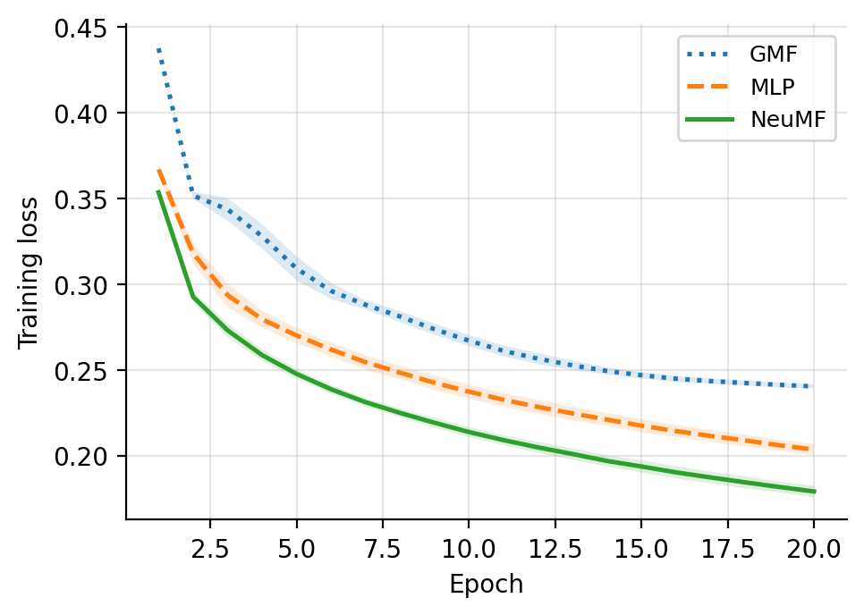
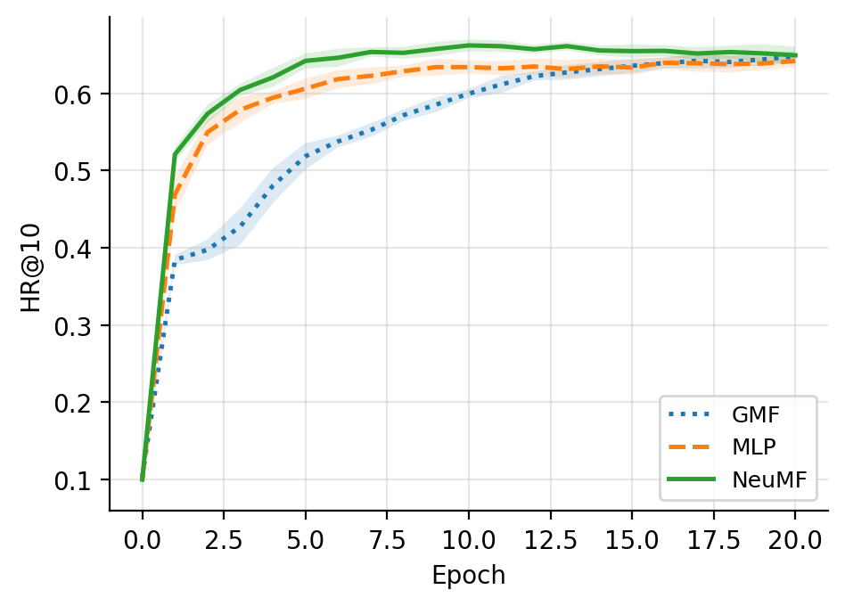
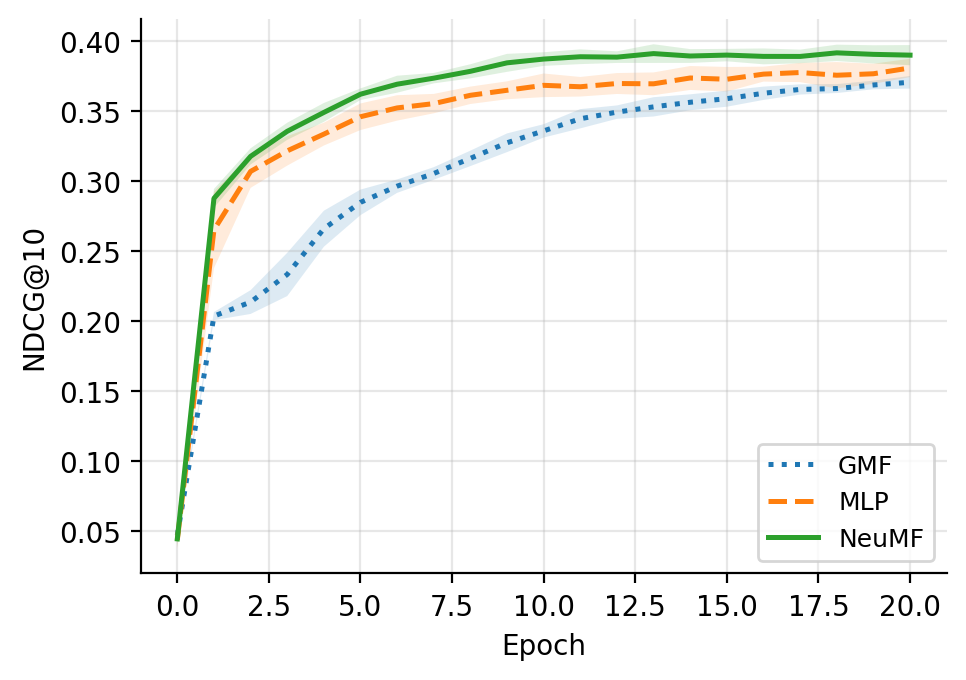
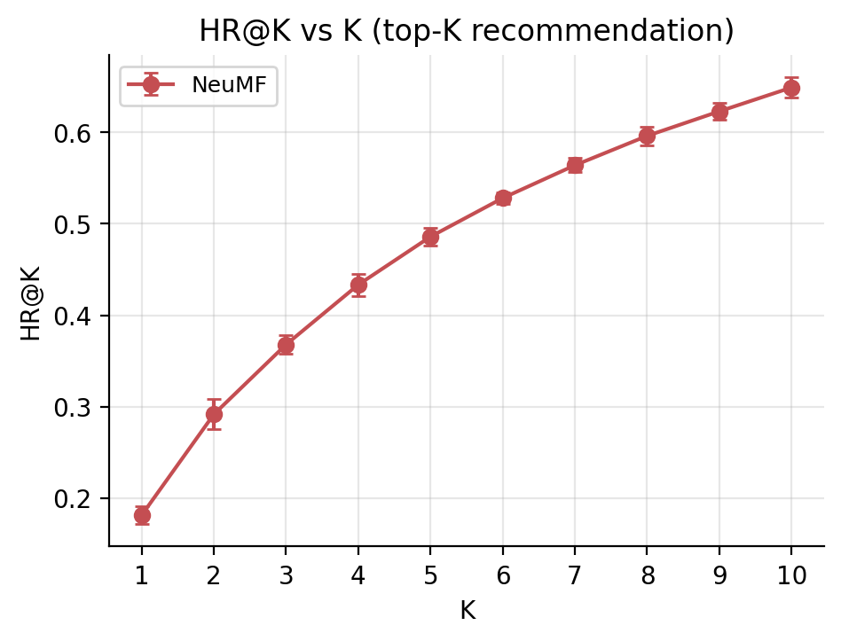
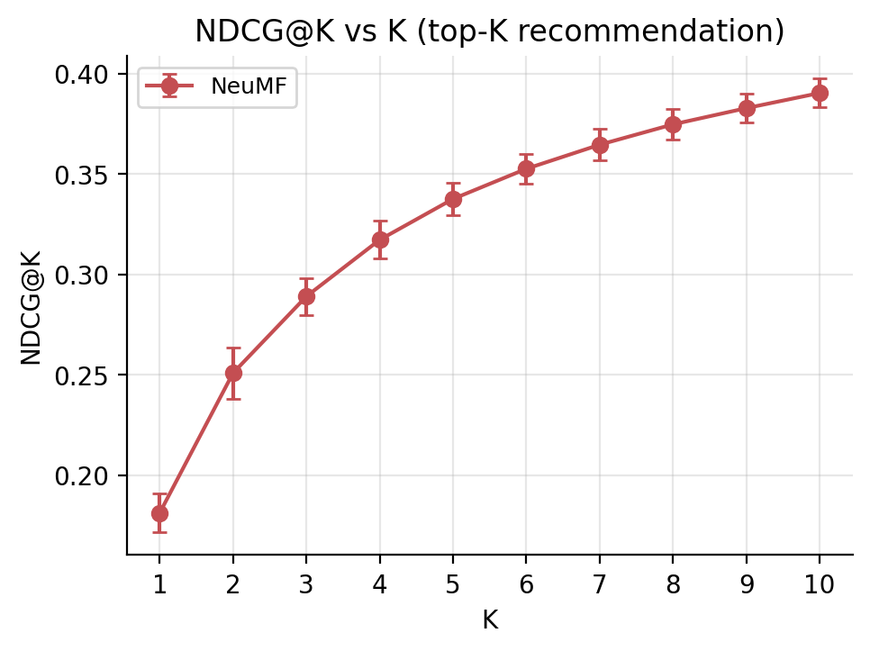
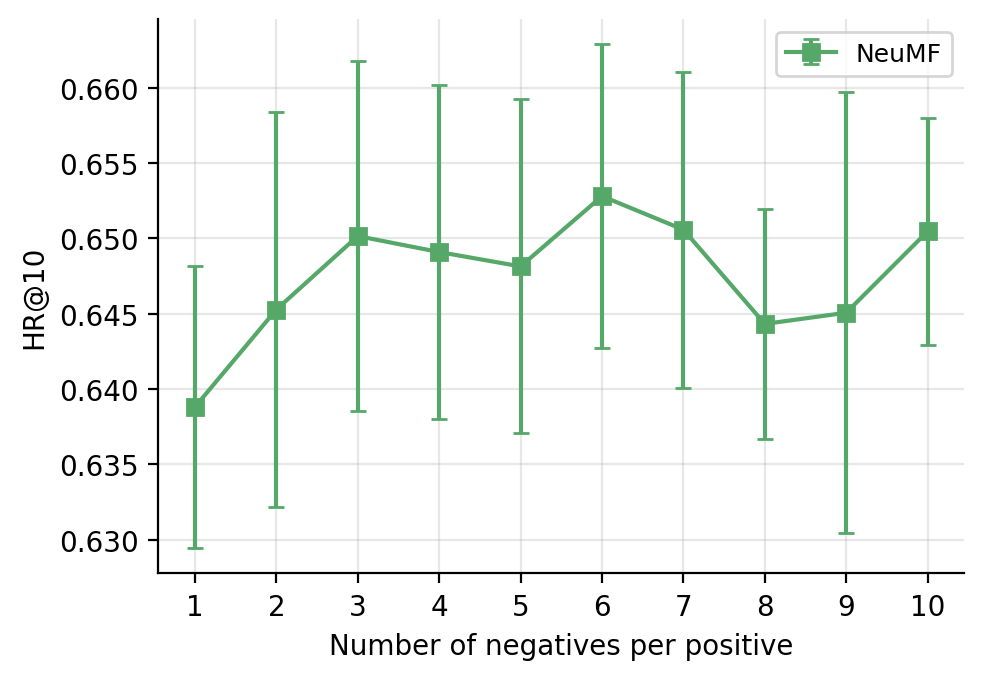
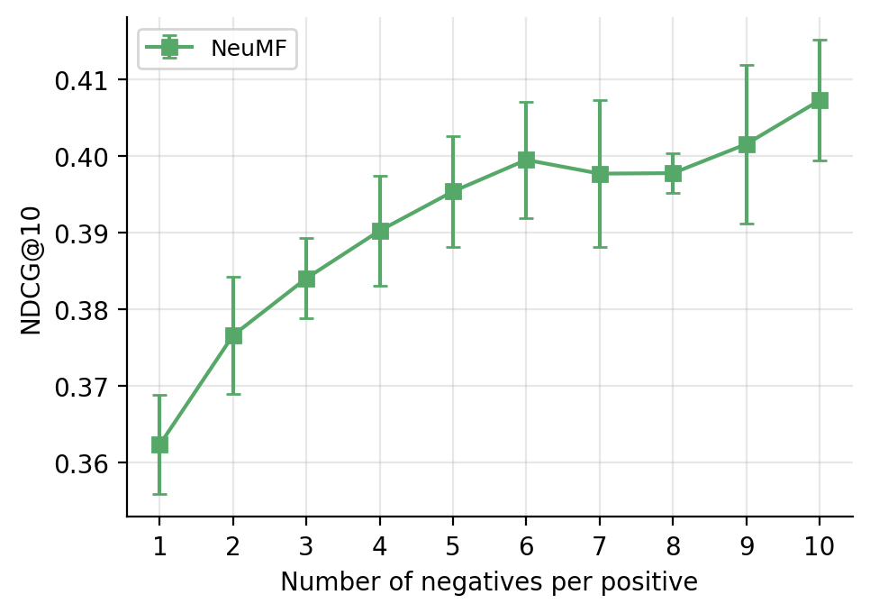
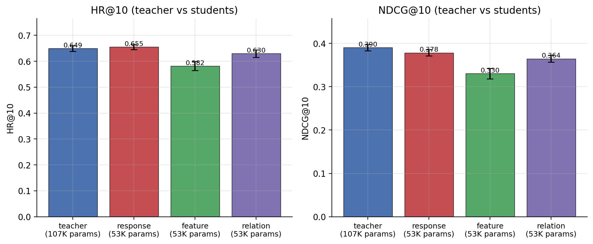

# NCF Assignment — ECE480 Deep Learning and its Applications

Reproduction of the **Neural Collaborative Filtering** paper
([He et al., WWW 2017](https://arxiv.org/abs/1708.05031)) on **MovieLens-100K**
(`u.data`) for ECE480 at the University of Thessaly.

Every experiment is repeated **10 times** with independent seeds, and all
results are reported as mean ± standard deviation, as required by the
assignment.

---

## Headline results

| Method | HR@10 | NDCG@10 | Parameters |
|:------|:-----:|:-------:|:----------:|
| **NeuMF (best)** — 3 MLP layers, no pretraining | **0.649 ± 0.011** | **0.390 ± 0.007** | 107,761 |
| NMF (best) — k = 26 latent factors | 0.635 ± 0.004 | 0.368 ± 0.003 | 68,250 |
| **NeuMF + response-based KD** (student, half the params) | **0.655 ± 0.010** | 0.378 ± 0.007 | **53,177** |
| NeuMF + relation-based KD (student) | 0.630 ± 0.014 | 0.364 ± 0.008 | 53,177 |
| NeuMF + feature-based KD (student) | 0.582 ± 0.017 | 0.330 ± 0.012 | 53,177 |

**Key findings:**
- NeuMF beats NMF on both metrics on MovieLens-100K, but uses ~58% more parameters.
- A NeuMF student trained with **response-based knowledge distillation matches
  (and slightly exceeds) the teacher's HR@10 with 50.7% fewer parameters** —
  fewer parameters than even the NMF baseline.
- On this small dataset, **MLP depth gives no clear benefit** (1, 2, and 3 layers
  are within one standard deviation of each other), unlike the paper's finding
  on MovieLens-1M.
- **Pretraining** (GMF + MLP → NeuMF initialisation) reduces run-to-run variance
  but provides no mean improvement on this dataset, likely because the
  prescribed Adam→SGD switch needs more epochs to catch up than our 20-epoch
  budget allows.

---

## Figures

### Training dynamics (Task 4) — reproduces Figure 6 of the NCF paper

<p align="center">
  
  
  
</p>

NeuMF achieves the lowest training loss, followed by MLP then GMF — exactly the
ordering reported in the paper on MovieLens-1M. HR@10 plateaus around epoch
10–13 and slightly degrades afterwards (mild overfitting), while training loss
keeps decreasing monotonically.

### Top-K recommendation (Tasks 5 & 6) — reproduces Figure 5 of the paper

<p align="center">
  
  
</p>

### Effect of negative sampling (Tasks 7 & 8) — reproduces Figure 7

<p align="center">
  
  
</p>

HR@10 saturates after ~3 negatives per positive; NDCG@10 continues to improve
up to 10 negatives.

### Knowledge distillation (Task 12)

<p align="center">
  
</p>

Response-based distillation (Hinton et al., 2015) preserves the teacher's
performance at 50.7% the parameter budget. FitNets-style feature matching
underperforms here.

See the full discussion of every task in [`report/report.pdf`](report/report.pdf).

---

## Project layout

```
.
├── data/
│   └── u.data                     # MovieLens-100K dataset (100K ratings, 943 users, 1682 items)
├── src/                           # Core library
│   ├── data.py                    # Leave-one-out split + negative sampling
│   ├── models.py                  # GMF, MLP, NeuMF (with pretraining support)
│   ├── evaluate.py                # HR@K, NDCG@K metrics
│   ├── train.py                   # Training loop
│   ├── nmf.py                     # scikit-learn NMF adapted for top-K
│   ├── distill.py                 # 3 knowledge-distillation techniques
│   └── utils.py                   # Seeding, parameter counting, I/O
├── experiments/                   # One script per assignment task
│   ├── config.py                  # Best-setting hyperparameters (Task 1)
│   ├── _common.py                 # Shared CLI / pretraining helper
│   ├── task02_mlp_layers.py       # HR@10 vs MLP layers (with/without pretraining)
│   ├── task03_params_vs_layers.py # Parameter count vs MLP layers
│   ├── task04_training_curves.py  # Loss / HR / NDCG vs epoch (Fig. 6 style)
│   ├── task05_06_at_k.py          # HR@K, NDCG@K for K=1..10 (Fig. 5 style)
│   ├── task07_08_negatives.py     # HR, NDCG vs number of negatives (Fig. 7 style)
│   ├── task09_10_nmf.py           # NMF latent-factor sweep + parameter count
│   ├── task11_compare.py          # NeuMF vs NMF comparison
│   ├── task12_kd.py               # 3 KD techniques (response / feature / relation)
│   ├── make_figures.py            # Produces all figures (PDF + PNG)
│   └── make_tables.py             # Produces LaTeX tables
├── notebooks/
│   └── kaggle_runner.ipynb        # One-click Kaggle GPU driver
├── results/                       # CSVs, figures/ and tables/ from the 10-seed run
├── report/                        # LaTeX report source and compiled PDF
│   ├── report.tex
│   └── report.pdf
├── run_all.sh                     # Run all tasks sequentially
└── requirements.txt
```

---

## Reproducing the results

### 1. Install dependencies

```bash
pip install -r requirements.txt
```

### 2. Smoke-test locally (CPU, ~5 min)

```bash
bash run_all.sh --fast
```

Runs every task with a small number of epochs and 2 seeds just to verify the
pipeline works end-to-end.

### 3. Full run on Kaggle GPU (~3–4 h)

Open `notebooks/kaggle_runner.ipynb` on Kaggle, enable a GPU (T4 or P100) and
Internet, and run all cells. The notebook clones this repo, installs
dependencies, and produces everything under `results/`.

The notebook also includes a fallback "run tasks one at a time" section in case
you need to resume from an interrupted Kaggle session.

### 4. (Optional) Rebuild the LaTeX report

```bash
cd report
pdflatex report.tex
pdflatex report.tex   # second pass for references
```

---

## Configuration

All experiments use the hyperparameters defined in `experiments/config.py`.
The *best setting* (Task 1) was chosen based on the paper's recommendations
and a small pilot study on MovieLens-100K:

| Hyperparameter              | Value |
| --------------------------- | ----- |
| GMF embedding dim           | 8     |
| MLP embedding dim           | 32    |
| MLP hidden layers           | 3 (tower: 64 → 32 → 16 → 8) |
| Optimizer (no pretraining)  | Adam, lr = 1e-3 |
| Optimizer (pretraining)     | SGD, lr = 1e-3  |
| Pretraining mix α           | 0.5   |
| Batch size                  | 256   |
| Negative samples / positive | 4     |
| Training epochs             | 20    |
| Repetitions per experiment  | 10    |

---

## Evaluation protocol

Standard leave-one-out evaluation, following the NCF paper exactly:

- For each user: held-out latest interaction as test, second-latest as
  validation, rest for training.
- At evaluation time: rank the held-out positive item against 99 randomly
  sampled negative items (items the user has *not* interacted with). HR@K
  and NDCG@K are computed on this 100-item list and averaged across users.

---

## Knowledge distillation (Task 12)

**Teacher:** best NeuMF (107,761 parameters).
**Students:** smaller NeuMF — `gmf_embed=4, mlp_embed=16, 2 layers`
(53,177 parameters, ≈ 50% reduction).

Three distinct distillation techniques are implemented:

1. **Response-based KD** (Hinton et al., 2015) — soft-target BCE with
   temperature scaling, combined with hard-label BCE.
2. **Feature-based KD / FitNets** (Romero et al., 2014) — MSE between the
   student's fused feature (with a learnable linear projection to the teacher's
   dimension) and the teacher's fused feature.
3. **Relation-based KD / RKD** (Park et al., 2019) — Huber loss between the
   pairwise L2-distance matrices of teacher vs projected-student fused features
   (scale-normalized as in the original paper).

---

## References

- He, X., Liao, L., Zhang, H., Nie, L., Hu, X., & Chua, T.-S. (2017).
  *Neural Collaborative Filtering.* WWW 2017.
  [paper](https://arxiv.org/abs/1708.05031)
- Gou, J., Yu, B., Maybank, S. J., & Tao, D. (2021).
  *Knowledge Distillation: A Survey.* IJCV.
  [paper](https://arxiv.org/abs/2006.05525)
- Hinton, G., Vinyals, O., & Dean, J. (2015).
  *Distilling the Knowledge in a Neural Network.*
  [paper](https://arxiv.org/abs/1503.02531)
- Romero, A., Ballas, N., Kahou, S. E., Chassang, A., Gatta, C., & Bengio, Y.
  (2014). *FitNets: Hints for Thin Deep Nets.*
  [paper](https://arxiv.org/abs/1412.6550)
- Park, W., Kim, D., Lu, Y., & Cho, M. (2019).
  *Relational Knowledge Distillation.* CVPR.
  [paper](https://arxiv.org/abs/1904.05068)
- Reference NCF implementations:
  [hexiangnan/neural_collaborative_filtering](https://github.com/hexiangnan/neural_collaborative_filtering) (TF),
  [guoyang9/NCF](https://github.com/guoyang9/NCF) (PyTorch).

---

## Author

**Nikos Mavros** — [nmavros@uth.gr](mailto:nmavros@uth.gr)
